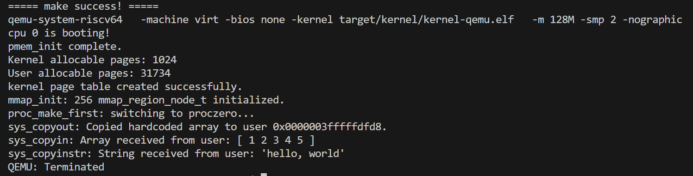

# ToasterOS
```
            xxxxxxxxxxxxxxxxxxxxxx                                                                                             
       xxxxxxxxxxxxxxxxxxxxxxxxxxxxxxxx                                                                                        
    xxxxxx x xx x xxx xx  xxxx xxxxxxxxx                                                                                       
 xxx                                xxxxx                                                                                      
 x                                    xxxxx                                    xx                      xxxx            xxxx    
x                                      xxxxx          xxxx xxxxxxx            xxxxxx      xxxx     xxxxxxx   xxxxxx  xxxxxxxx  
x           @@@@       @@@@            xxxx      xxxxxxxxxxx                 xx   xxx   xxxxxx  xxxxxxxx    xxxxx xx xxx  xxx  
x           @  @       @  @           xxxx  xxxxxxxxxx xx        xxxxxxx     xx    xxx  xx           xx     x        xx  xxxx  
x           @  @       @  @          xxx             xxxx   xxxxxxxxxxxxxxx  xxxxxxxxx  xxxxxx      xxx    xxxxxxxxx  xxxxxx   
xx          @@@@       @@@@        xxxx              xxx    x xx       xxxx  xxxxxxxxx  xxxxxxx     xxx    xxxxxxx    xxxx     
  xxx                           xxxxxx               x xx   xxxx          xx xx     xx      xxxxxx  xxx    xx         xx xxxx  
      xxx \ \             \ \   xxxxx                x xx   xxx          xxx xx     xx         xx   xxx    xxx        xx    xxx
        x                       xx xx                xxxx   xxxxxx     xxxx  xx     xx    xxxxxxx    xx     xxxxxxxx  xx      x
         x                      xxxxx                xxxx      xxxxxxxxxxx    x      x  xxxx                          xx       
         x                      xxxxx                xxxx        x xxxx                                                 x      
         x     xxx       xx     xxxxx                 xx              xxx                    xxxxxxxxxxx                       
         x   xxx          xxxx  xxxxx                  x            xxxxxxxxxxxxx          xxxxxx   xxxxx                      
         x  xx x         xx     xxxxx                             xx x  xxxx    xxxx       xxxx        xx                      
         x     xxx     xxx      xxxxx                             x xxxx          xxx       xx                                 
         x       xxxxxx         xxxxxx                            xxx              xxx       xxxxxxxxxx                        
         x                      xxxxxx                             xx               xx           xx xxxxxx                     
         x                      xxxxxx                             xxx             xxx               xxxxx                     
         x                      xxxxxx                             xxxxxx         xx x                 xxx                     
         x                      xxxx x                              xxxxxxxxxx  xx  x       xxx     xxxxx                      
         x                      xxxx x                                 x xxxxxxxxxxx         xxxxxxxxxxx                       
         x                     xxxxx x                                                                                         
         x                     xxxxx x                                                                                         
         xxxxxxxxxxxxxxxx xx x x  x                                                                                            
                                  x                                                                                            ⠀⠀⠀⠀⠀⠀⠀⠀⠀⠀⠀⠀⠀⠀⠀⠀⠀⠀⠀⠀⠀⠀
```
ECNU Operating System 2025 Fall Final Project 

**Contributors**: 
- [ToasterToasterToast](https://github.com/ToasterToastsToast) - 前三个任务
- [syqwq](https://github.com/syqwq-OMG) - 后两个任务

--- 
## 任务1：用户态和内核态的数据迁移

在lab-4中，用户程序输出的hello world硬编码在陷阱处理函数里。在这个task中，我们要实现用户与内核的数据迁移，让用户既可以从内核读取内容，也可以把数据交给内核输出。`uvm_copyin()`从用户态读数据到内核，`uvm_copyout()`从内核态写数据给用户，`uvm_copyin_str()`从用户态读取字符串到内核。相应地，我们有三个系统调用函数用于测试此功能。`sys_copyout()`将硬编码整数数组传输给`uvm_copyout()`，测试内核能否写入用户内存。`sys_copyin()`获取用户程序提供的源地址,调用`uvm_copyin()`读取整数数组并打印。`sys_copyinstr()`验证 `uvm_copyin_str` 函数能否安全地从用户空间拷贝一个字符串("hello, world")到内核。

成功截图：


可以通过寄存器完成内核和用户的值传递，但是内核不能直接读取用户的指针，因为用户传入的地址空间是基于用户页表的, 但是进入内核后使用的是内核页表。用户看到的连续虚拟内存，可能分散在不同的物理页上。解决这个问题需要手动查询用户页表, 找到虚拟地址对应的物理地址, 之后再做数据迁移。

`uvm_copyout`接收页表，目标地址，原地址和数组长度。使用了一个while循环，每次处理一页内容，防止物理地址页面分散。程序根据虚拟地址和页表，在PTE查找物理页并合成物理地址。程序体现了虚拟地址和物理地址有不同的页号和相同的页内偏移。这一过程还需检查PTE有效且可写。最后，在这个操作系统实现中，物理内存被线性映射到内核地址空间的一段区域。因此，内核可以直接使用物理地址（或者 PA + 某个固定偏移）来访问数据。因此我们用memmove来拷贝。

`uvm_copyin`是该过程的反向。`uvm_copyin_str`是在遇到`\0`时return，整体上类似。

## 任务2：堆的手动管理与栈的自动管理

实现动态增长的栈和堆。

### 堆

实现处理堆的系统调用和用户函数。


## 0xff. references
- [labs assignments](https://gitee.com/xu-ke-123/ecnu-oslab-2025-task)
- [riscv简单常用汇编指令xv6](https://blog.csdn.net/surfaceyan/article/details/135030477)
