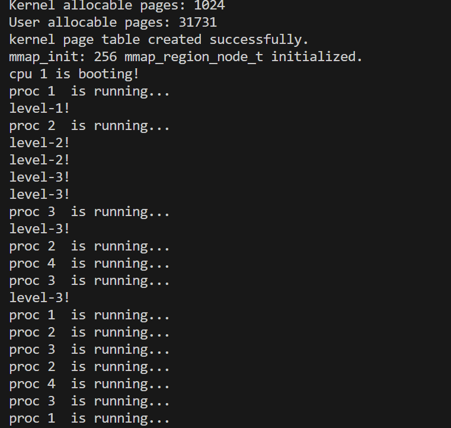
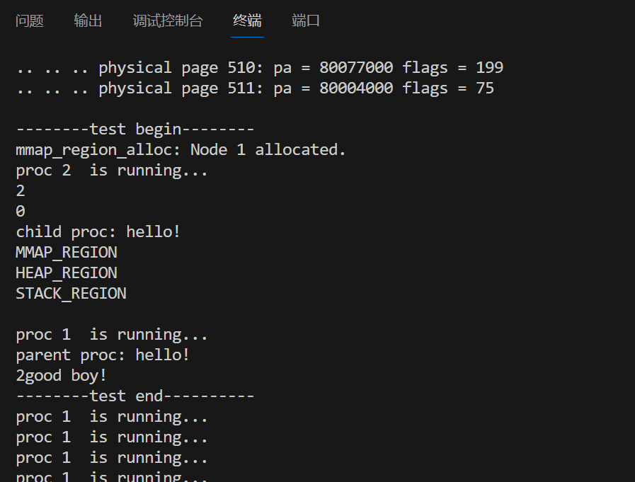
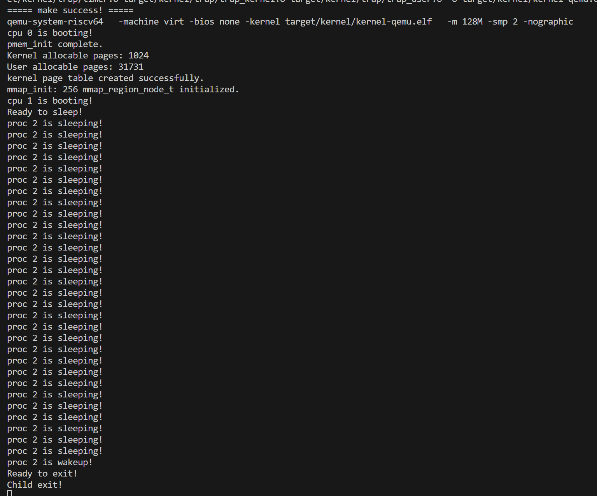

# ToasterOS
```
            xxxxxxxxxxxxxxxxxxxxxx                                                                                             
       xxxxxxxxxxxxxxxxxxxxxxxxxxxxxxxx                                                                                        
    xxxxxx x xx x xxx xx  xxxx xxxxxxxxx                                                                                       
 xxx                                xxxxx                                                                                      
 x                                    xxxxx                                    xx                      xxxx            xxxx    
x                                      xxxxx          xxxx xxxxxxx            xxxxxx      xxxx     xxxxxxx   xxxxxx  xxxxxxxx  
x           @@@@       @@@@            xxxx      xxxxxxxxxxx                 xx   xxx   xxxxxx  xxxxxxxx    xxxxx xx xxx  xxx  
x           @  @       @  @           xxxx  xxxxxxxxxx xx        xxxxxxx     xx    xxx  xx           xx     x        xx  xxxx  
x           @  @       @  @          xxx             xxxx   xxxxxxxxxxxxxxx  xxxxxxxxx  xxxxxx      xxx    xxxxxxxxx  xxxxxx   
xx          @@@@       @@@@        xxxx              xxx    x xx       xxxx  xxxxxxxxx  xxxxxxx     xxx    xxxxxxx    xxxx     
  xxx                           xxxxxx               x xx   xxxx          xx xx     xx      xxxxxx  xxx    xx         xx xxxx  
      xxx \ \             \ \   xxxxx                x xx   xxx          xxx xx     xx         xx   xxx    xxx        xx    xxx
        x                       xx xx                xxxx   xxxxxx     xxxx  xx     xx    xxxxxxx    xx     xxxxxxxx  xx      x
         x                      xxxxx                xxxx      xxxxxxxxxxx    x      x  xxxx                          xx       
         x                      xxxxx                xxxx        x xxxx                                                 x      
         x     xxx       xx     xxxxx                 xx              xxx                    xxxxxxxxxxx                       
         x   xxx          xxxx  xxxxx                  x            xxxxxxxxxxxxx          xxxxxx   xxxxx                      
         x  xx x         xx     xxxxx                             xx x  xxxx    xxxx       xxxx        xx                      
         x     xxx     xxx      xxxxx                             x xxxx          xxx       xx                                 
         x       xxxxxx         xxxxxx                            xxx              xxx       xxxxxxxxxx                        
         x                      xxxxxx                             xx               xx           xx xxxxxx                     
         x                      xxxxxx                             xxx             xxx               xxxxx                     
         x                      xxxxxx                             xxxxxx         xx x                 xxx                     
         x                      xxxx x                              xxxxxxxxxx  xx  x       xxx     xxxxx                      
         x                      xxxx x                                 x xxxxxxxxxxx         xxxxxxxxxxx                       
         x                     xxxxx x                                                                                         
         x                     xxxxx x                                                                                         
         xxxxxxxxxxxxxxxx xx x x  x                                                                                            
                                  x                                                                                            ⠀⠀⠀⠀⠀⠀⠀⠀⠀⠀⠀⠀⠀⠀⠀⠀⠀⠀⠀⠀⠀⠀
```
ECNU Operating System 2025 Fall Final Project 

**Contributors**: 
- [ToasterToasterToast](https://github.com/ToasterToastsToast) - readme和代码审查
- [syqwq](https://github.com/syqwq-OMG) - 主要程序实现


---

### 进程管理机制的实现与分析

进程管理模块围绕初始化、分配、回收与状态流转展开，其核心是对进程结构体仓库的组织调度以及资源的安全管理。

系统启动后，`proc_init` 建立进程结构体的基础框架：初始化全局 PID 锁 `pid_lk` 和等待锁 `wait_lk`，将 `global_pid` 置为 1，并遍历预分配的 `proc_list` 初始化每个槽位的私有自旋锁及 `UNUSED` 状态。同时预计算内核栈虚拟地址 `kstack`，为后续创建提供环境。

进程结构体的分配由 `proc_alloc` 完成。其通过带锁扫描查找 `UNUSED` 槽位，锁定后调用 `alloc_pid` 生成唯一 PID 并完成基础初始化，包括分配 Trapframe 页、建立映射 trampoline 与 trapframe 的页表 `p->pgtbl`，以及设置初始内核上下文 `p->ctx`。其中返回地址 `ra` 被设为 `proc_return`，确保首次调度时能正确从内核过渡至用户态。函数返回时调用者仍持有 `p->lk`，以保障后续构造（`fork` 或 `make_first`）的原子性。

进程回收由 `proc_free` 执行，要求调用者已持有 `p->lk`。该函数释放 Trapframe 页、销毁页表 `p->pgtbl`，清空 PID 与父子关系并将状态重置为 `UNUSED`，最终释放 `p->lk`。槽位由此重新进入可分配状态。

创建首个用户进程的工作由 `proc_make_first` 完成。通过 `proc_alloc` 获取结构体后，该函数构造独立的用户地址空间，设置用户栈与代码段，加载 `initcode`，并在 Trapframe 中设定 `epc = USER_BASE` 与栈顶指针，从而形成可运行的用户态初始上下文。进程名称设定后状态提升至 `RUNNABLE`，并释放锁，等待调度器接管执行。

---

### 进程调度与上下文切换

系统初始化结束后，各 CPU 进入 `proc_scheduler` 的永不返回循环，成为调度器实体。调度器开启中断，通过循环扫描 `proc_list` 查找 `RUNNABLE` 进程，并在锁定目标后将其状态改为 `RUNNING`、更新 `mycpu()->proc` 指针，再通过 `swtch(&c->ctx, &p->ctx)` 转交 CPU 控制权。此处调度器的执行流冻结，直至进程返回。

用户进程主动让出 CPU（如 `proc_yield`）或因阻塞、退出等原因需要调度时，会调用 `proc_sched`。该函数保存当前内核上下文到 `p->ctx`，并通过 `swtch(&p->ctx, &mycpu()->ctx)` 切换回调度器。调度器从首次 `swtch` 返回点恢复，清空 `CPU->proc` 并再次扫描以选取新进程。用户进程之间的切换因此总是经由调度器实现的双重切换。

---

### 抢占式调度、进程生命周期与同步原语

本系统采用基于时钟中断的协作式抢占调度：每次时钟中断结束后，内核强制调用 `proc_yield`。该函数在持有进程锁的前提下将状态从 `RUNNING` 变为 `RUNNABLE` 并调用 `proc_sched`，实现时间片轮转，保证执行公平性。

进程的生命周期包括创建、退出与回收。`proc_fork` 通过 `proc_alloc` 创建子进程，复制父进程的地址空间、Trapframe 以及父子关系，并将子进程标记为 `RUNNABLE`。`proc_exit` 将所有子进程过继给 `proczero`，记录退出码，唤醒父进程并将自身置为 `ZOMBIE`，随后调用 `proc_sched` 让出 CPU。父进程通过 `proc_wait` 在子进程死亡后回收资源：扫描子进程，当检测到 `ZOMBIE` 状态时读取退出码并调用 `proc_free` 完成回收。

同步通过 `proc_sleep` 与 `proc_wakeup` 实现。进程因资源不可用而睡眠时，内核在持有进程锁的前提下将其状态设为 `SLEEPING`，释放资源锁并通过 `proc_sched` 切出 CPU。事件到来时，`proc_wakeup` 将等待指定通道的进程重新置为 `RUNNABLE`。这种原子化的状态转换避免了丢失唤醒竞态。睡眠锁（Sleep Lock）在此基础上构建：内部通过自旋锁保护自身状态，而在锁已被占用时使用 `proc_sleep` 睡眠等待，从而避免长期自旋导致的无效 CPU 消耗，适用于文件系统等需要长期持有锁的场景。

## 测试


上下文别的输出没注释掉

## 0xff. references
- [labs assignments](https://gitee.com/xu-ke-123/ecnu-oslab-2025-task)
- [riscv简单常用汇编指令xv6](https://blog.csdn.net/surfaceyan/article/details/135030477)
