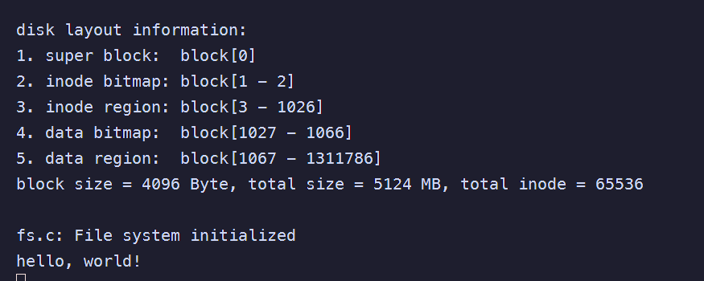
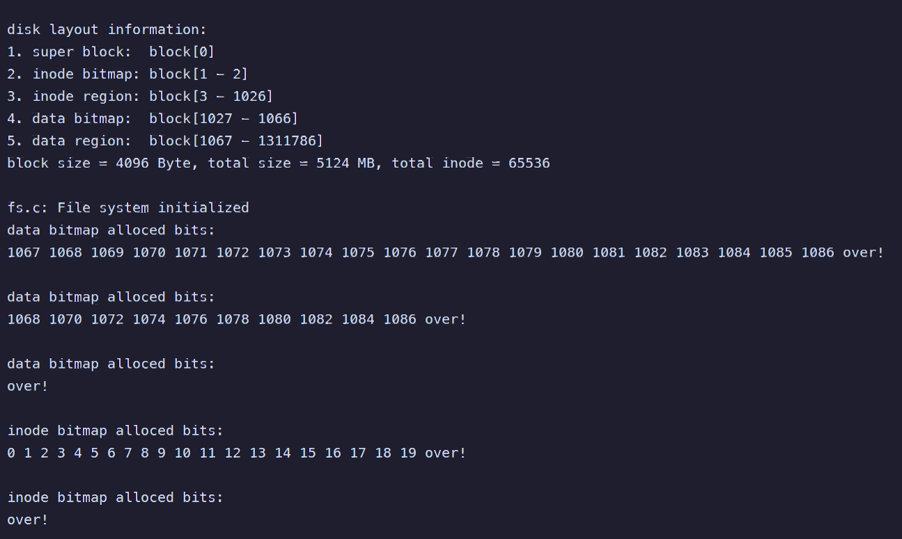
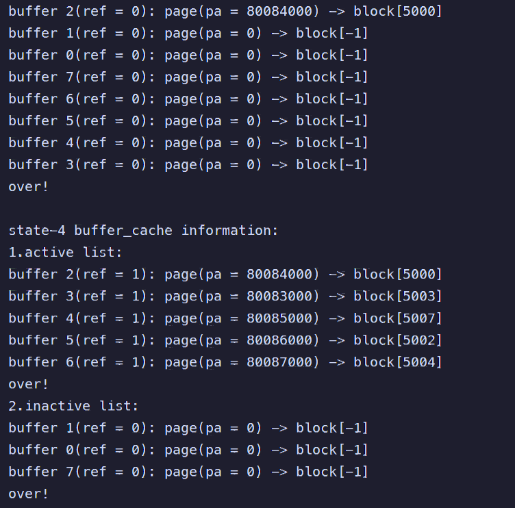
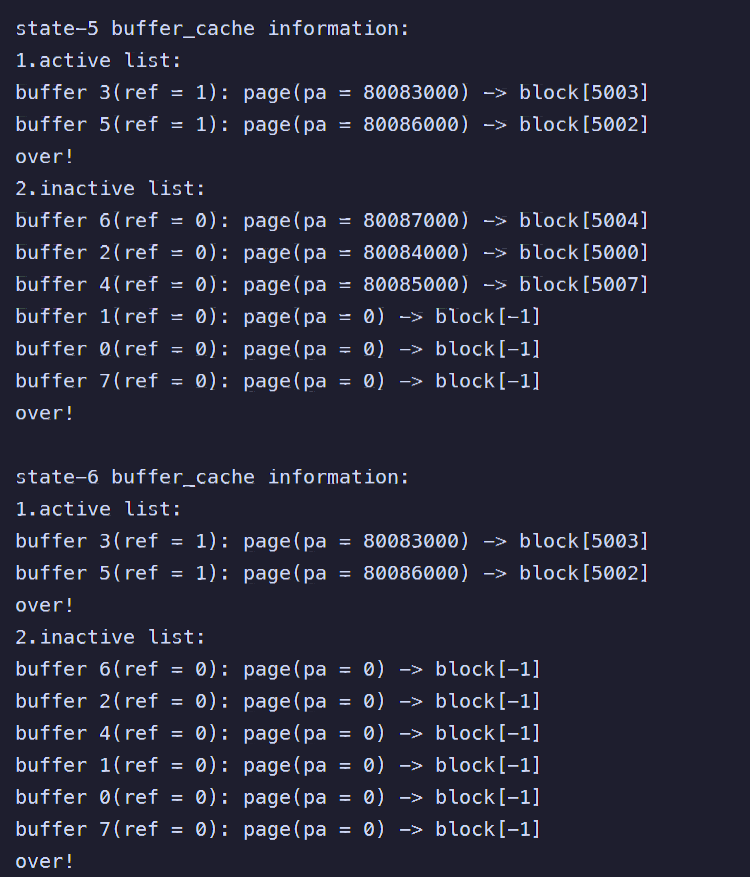

# ToasterOS
```
            xxxxxxxxxxxxxxxxxxxxxx                                                                                             
       xxxxxxxxxxxxxxxxxxxxxxxxxxxxxxxx                                                                                        
    xxxxxx x xx x xxx xx  xxxx xxxxxxxxx                                                                                       
 xxx                                xxxxx                                                                                      
 x                                    xxxxx                                    xx                      xxxx            xxxx    
x                                      xxxxx          xxxx xxxxxxx            xxxxxx      xxxx     xxxxxxx   xxxxxx  xxxxxxxx  
x           @@@@       @@@@            xxxx      xxxxxxxxxxx                 xx   xxx   xxxxxx  xxxxxxxx    xxxxx xx xxx  xxx  
x           @  @       @  @           xxxx  xxxxxxxxxx xx        xxxxxxx     xx    xxx  xx           xx     x        xx  xxxx  
x           @  @       @  @          xxx             xxxx   xxxxxxxxxxxxxxx  xxxxxxxxx  xxxxxx      xxx    xxxxxxxxx  xxxxxx   
xx          @@@@       @@@@        xxxx              xxx    x xx       xxxx  xxxxxxxxx  xxxxxxx     xxx    xxxxxxx    xxxx     
  xxx                           xxxxxx               x xx   xxxx          xx xx     xx      xxxxxx  xxx    xx         xx xxxx  
      xxx \ \             \ \   xxxxx                x xx   xxx          xxx xx     xx         xx   xxx    xxx        xx    xxx
        x                       xx xx                xxxx   xxxxxx     xxxx  xx     xx    xxxxxxx    xx     xxxxxxxx  xx      x
         x                      xxxxx                xxxx      xxxxxxxxxxx    x      x  xxxx                          xx       
         x                      xxxxx                xxxx        x xxxx                                                 x      
         x     xxx       xx     xxxxx                 xx              xxx                    xxxxxxxxxxx                       
         x   xxx          xxxx  xxxxx                  x            xxxxxxxxxxxxx          xxxxxx   xxxxx                      
         x  xx x         xx     xxxxx                             xx x  xxxx    xxxx       xxxx        xx                      
         x     xxx     xxx      xxxxx                             x xxxx          xxx       xx                                 
         x       xxxxxx         xxxxxx                            xxx              xxx       xxxxxxxxxx                        
         x                      xxxxxx                             xx               xx           xx xxxxxx                     
         x                      xxxxxx                             xxx             xxx               xxxxx                     
         x                      xxxxxx                             xxxxxx         xx x                 xxx                     
         x                      xxxx x                              xxxxxxxxxx  xx  x       xxx     xxxxx                      
         x                      xxxx x                                 x xxxxxxxxxxx         xxxxxxxxxxx                       
         x                     xxxxx x                                                                                         
         x                     xxxxx x                                                                                         
         xxxxxxxxxxxxxxxx xx x x  x                                                                                            
                                  x                                                                                            ⠀⠀⠀⠀⠀⠀⠀⠀⠀⠀⠀⠀⠀⠀⠀⠀⠀⠀⠀⠀⠀⠀
```


## 1. 模块实现详解

### 第一阶段：磁盘驱动与内核基础设施

**目标**：让内核识别磁盘，建立内存映射，并能响应磁盘中断。

#### 1. 引入磁盘驱动 (`src/kernel/fs/virtio.c`)

* **功能**：实现 VirtIO 协议，提供 `virtio_disk_rw` 接口供上层调用。
* **实现要点**：
* **初始化 (`virtio_disk_init`)**：配置 VirtIO 寄存器，协商特性，分配 DMA 队列。
* **读写 (`virtio_disk_rw`)**：封装请求到描述符链，通知设备，然后调用 `proc_sleep` 进入睡眠等待中断。
* **中断处理 (`virtio_disk_intr`)**：当磁盘操作完成时触发，负责回收描述符并调用 `proc_wakeup` 唤醒等待的进程。


#### 2. 内存映射 (`src/kernel/mem/kvm.c`)

* **任务**：VirtIO 设备是通过 MMIO (Memory Mapped I/O) 访问的，需要在内核页表中建立映射。
* **修改**：
* 在 `kvm_init` 中增加对 `VIRTIO_BASE` 的映射。
* 修改 `vm_getpte`：由于驱动可能会传入 `NULL` 作为页表参数（表示内核页表），需要增加判空逻辑 `if (pgtbl == NULL) pgtbl = kernel_pgtbl;`。


#### 3. 中断配置 (`src/kernel/trap/plic.c` & `trap_kernel.c`)

* **PLIC 配置**：
* 在 `plic_init` 中设置磁盘中断（`VIRTIO_IRQ`）的优先级。
* 在 `plic_inithart` 中开启磁盘中断的使能位（Enable）。


* **中断响应**：
* 在 `trap_kernel.c` 的 `external_interrupt_handler` 中增加 `case VIRTIO_IRQ:` 分支，调用 `virtio_disk_intr()`。


#### 4. 系统启动 (`src/kernel/main.c`)

* 在 `main` 函数中调用 `virtio_disk_init()`。

---

### 第二阶段：缓冲系统

**目标**：实现 `src/kernel/fs/buf.c`，管理内存中的 Block 缓存，作为磁盘与内存的桥梁。

#### 1. 数据结构

* 使用双向循环链表管理 buffer。为了实现 LRU（最近最少使用），通常维护两个链表：
* **活跃链表 (Active List)**：正在被使用的 buffer（`ref > 0`）。
* **非活跃链表 (Inactive List)**：空闲的 buffer（`ref == 0`）。


#### 2. 核心函数实现

* **`buffer_init`**：初始化锁和链表头，将所有 buffer 插入非活跃链表。
* **`buffer_get(block_num)`**：
1. **查找**：先在活跃链表找，再在非活跃链表找。
2. **命中 (Hit)**：如果找到，引用计数 `ref++`，将其移到活跃链表头部。
3. **未命中 (Miss)**：从非活跃链表**尾部**取出一个 buffer（LRU 淘汰策略）。
4. **物理内存分配**：如果取出的 buffer 没有关联物理页（`data == NULL`），需调用 `pmem_alloc` 分配。
5. **重置**：更新 `block_num`，`ref = 1`，移入活跃链表，并读取磁盘数据（如果是新 Block）。


* **`buffer_put(buf)`**：
* 引用计数 `ref--`。
* 如果 `ref == 0`，将 buffer 移回非活跃链表。


* **`buffer_read/write`**：
* 持有睡眠锁 (`sleeplock`) 保证独占访问。
* 调用 `virtio_disk_rw` 执行实际 I/O。


---

### 第三阶段：Bitmap 管理

**目标**：实现 `src/kernel/fs/bitmap.c`，管理磁盘空间的分配。

#### 1. 核心逻辑

* **`bitmap_alloc_block/inode`**：
* 遍历 Bitmap 区域的所有 Block。
* 调用 `bitmap_search_and_set` 在块内寻找空闲位（bit 为 0）。
* 找到后置 1，并返回全局索引。


* **`bitmap_free_block/inode`**：
* 根据索引计算所在的 Block 和偏移量。
* 将对应 bit 置 0。


* **辅助函数**：
* `bitmap_search_and_set`：需处理最后一个 Block 不满的情况，利用位运算加速查找。


---

### 第四阶段：系统调用

**目标**：暴露内核功能供用户程序测试。

#### 1. 注册系统调用

在 `src/kernel/syscall/syscall.c` 和 `sysfunc.c` 中实现以下调用：

* **Bitmap 操作**：`sys_alloc_block`, `sys_free_block`, `sys_show_bitmap` 等。
* **Buffer 操作**：`sys_get_block`, `sys_read_block` (拷贝数据到用户态), `sys_write_block`, `sys_flush_buffer` 等。

---

## 2. 关键并发问题修复 

在实现过程中，除了基本的逻辑，修正了两个并发 Bug。

1. **进程调度器上下文切换 (Context Switch)**
* **问题**：`proc_scheduler` 中为了获取 PID 修改了 `tp` 寄存器，但切换回来后未恢复。导致 `spinlock` 判断 CPU ID 出错。
* **修复**：在 `swtch` 返回后立即恢复 `tp`。


```c
swtch(&mycpu()->context, &p->context);
w_tp(cpuid);

```


2. **睡眠锁竞态条件 (Sleep Race Condition)**
* **问题**：`proc_sleep` 中检查 `p->lk.locked` 状态是不安全的。
* **修复**：通过判断锁的地址来决定是否需要获取锁。


```c
void proc_sleep(void *chan, spinlock_t *lk) {
    proc_t *p = myproc();
    if(lk != &p->lk) { // 如果持有的不是进程锁，则交换锁
        spinlock_acquire(&p->lk);
        spinlock_release(lk);
    }
    p->state = SLEEPING;
    proc_sched();
    // ... 唤醒后恢复锁 ...
}

```


---

## 3. 测试与验证

test 1



test 2


test 3




