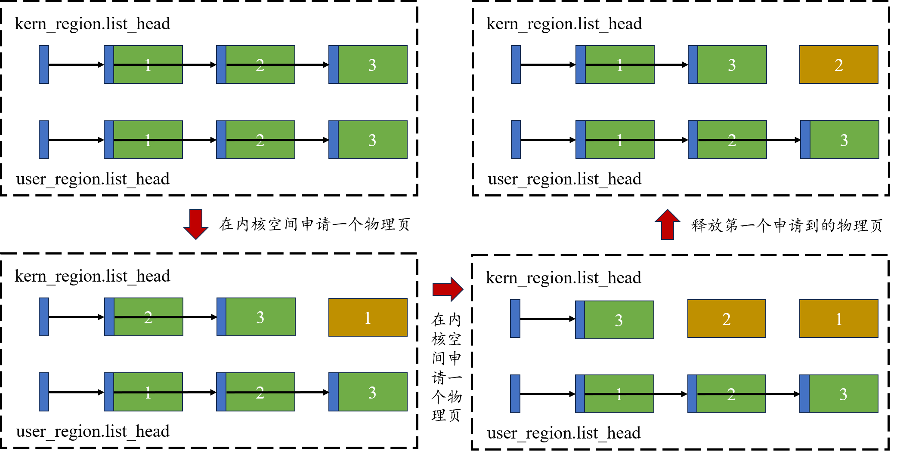
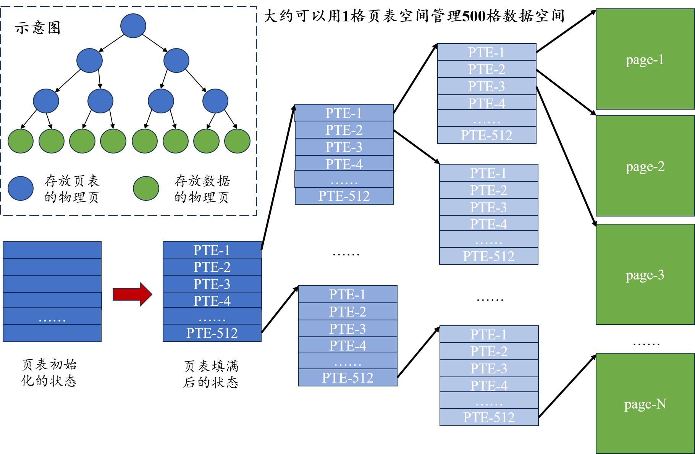
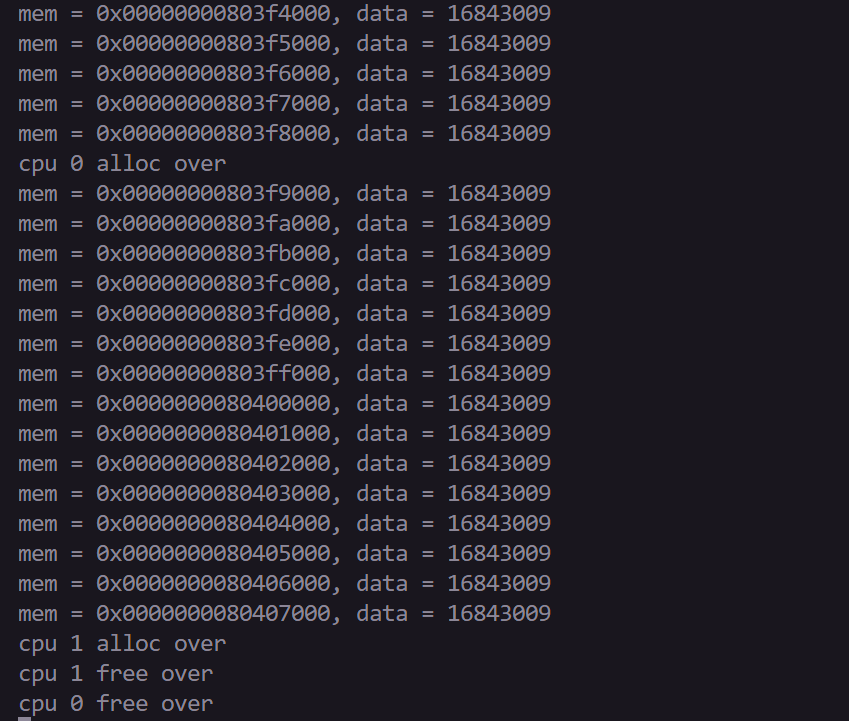
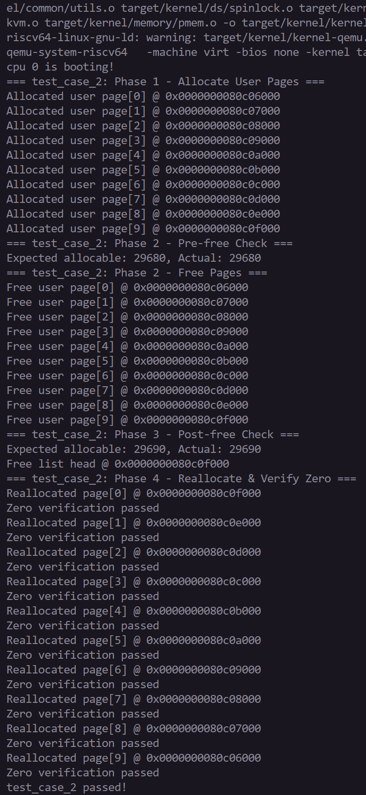

# LAB-2: 内存管理初步

**前言**

在lab-1中, 我们学习了机器启动流程、UART设备驱动、格式化输出和自旋锁

完成lab-1后, OS内核已经可以进入main函数并掌控UART资源做一些输出了

在lab-2中, 我们要开始认识和管理“程序除了CPU外最常访问的共享资源——内存”

内存管理的实现不是一步到位的, lab-2主要关注物理内存和内核态虚拟内存, 剩余部分将在后面的实验逐渐完善

## 代码组织结构
```
ECNU-OSLAB-2025-TASK
├── LICENSE        开源协议
├── .vscode        配置了可视化调试环境
├── registers.xml  配置了可视化调试环境
├── common.mk      Makefile中一些工具链的定义
├── Makefile       编译运行整个项目 (CHANGE, 增加trap和mem目录作为target)
├── kernel.ld      定义了内核程序在链接时的布局 (CHANGE, 增加一些关键位置的标记)
├── pictures       README使用的图片目录 (CHANGE, 日常更新)
├── README.md      实验指导书 (CHANGE, 日常更新)
└── src            源码
    └── kernel     内核源码
        ├── arch   RISC-V相关
        │   ├── method.h
        │   ├── mod.h
        │   └── type.h
        ├── boot   机器启动
        │   ├── entry.S
        │   └── start.c
        ├── lock   锁机制
        │   ├── spinlock.c
        │   ├── method.h
        │   ├── mod.h
        │   └── type.h
        ├── lib    常用库
        │   ├── cpu.c
        │   ├── print.c
        │   ├── uart.c
        │   ├── utils.c (NEW, 工具函数)
        │   ├── method.h (CHANGE, utils.c的函数声明)
        │   ├── mod.h
        │   └── type.h
        ├── mem    内存模块
        │   ├── pmem.c (TODO, 物理内存管理)
        │   ├── kvm.c (TODO, 内核态虚拟内存管理)
        │   ├── method.h (NEW)
        │   ├── mod.h (NEW)
        │   └── type.h (NEW)
        ├── trap   陷阱模块
        │   ├── method.h (NEW)
        │   ├── mod.h (NEW)
        │   └── type.h (NEW, 增加CLINT和PLIC寄存器定义)
        └── main.c (TODO)
```
**标记说明**

**NEW**: 新增源文件, 直接拷贝即可, 无需修改

**CHANGE**: 旧的源文件发生了更新, 直接拷贝即可, 无需修改

**TODO**: 你需要实现新功能 / 你需要完善旧功能

## 第一阶段: 物理内存

首先需要关注的文件是 **kernel.ld** 文件, 它规定了内核文件 **kernel-qemu.elf** 在载入内存时的布局

物理内存按照地址空间划分为三个部分：

- **0x80000000 ~ KERNEL_DATA** 存放了 **kernel-qemu.elf的代码**

- **KERNEL_DATA ~ ALLOC_BEGIN** 存放了 **kernel-qemu.elf的数据**

- **ALLOC_BEGIN ~ ALLOC_END** 属于 **未使用的可分配的物理页**

如果你想深入了解可执行文件(ELF)的布局信息, 可以自行查阅资料, 在lab-9中我们会再提

前两个区域的物理页会一直被内核占用, 不会纳入动态分配和回收的范围, 需要管理的只有第三个区域的物理页

首先介绍物理内存管理的基本原理: **4KB物理页切分 + 空闲链表组织**

**ALLOC_BEGIN ~ ALLOC_END** 这块物理空间被切分为N个4KB物理页(不会有剩余)

此外, 考虑到内核与用户空间的强制隔离, 我们设置了两个`alloc_region`, 基于**KENREL_PAGE**进行边界划分

`kernel_region` 记录了内核空间的空闲物理页情况, `user_region` 记录了用户空间的空闲物理页情况

`alloc_region` 描述了一组空闲页链表, 包括起止位置、空闲页面数量、链表头节点、保证一致性的锁

下面的图片显示了物理页的申请和释放在链表上是如何体现的



接下来讨论物理内存管理的函数实现:

```
void pmem_init();    // 初始化系统, 只调用一次
void* pmem_alloc();  // 申请一个空闲的物理页
void pmem_free();    // 释放一个之前申请的物理页
```

这三个函数体现了经典的共享资源管理方法：初始化共享资源, 占有共享资源, 释放共享资源

在**kernel/lib/utils.c**里我们新增了三个辅助函数, 能简化一些操作

为了保证资源共享的可靠性, 当尝试访问`alloc_region`时需要获取和释放自旋锁

## 第一阶段: 测试用例

**test-1**

```c
volatile static int started = 0;

volatile static int over_1 = 0, over_2 = 0;

static int* mem[1024];

int main()
{
    int cpuid = r_tp();

    if(cpuid == 0) {

        print_init();
        pmem_init();

        printf("cpu %d is booting!\n", cpuid);
        __sync_synchronize();
        started = 1;

        for(int i = 0; i < 512; i++) {
            mem[i] = pmem_alloc(true);
            memset(mem[i], 1, PGSIZE);
            printf("mem = %p, data = %d\n", mem[i], mem[i][0]);
        }
        printf("cpu %d alloc over\n", cpuid);
        over_1 = 1;
        
        while(over_1 == 0 || over_2 == 0);
        
        for(int i = 0; i < 512; i++)
            pmem_free((uint64)mem[i], true);
        printf("cpu %d free over\n", cpuid);

    } else {

        while(started == 0);
        __sync_synchronize();
        printf("cpu %d is booting!\n", cpuid);
        
        for(int i = 512; i < 1024; i++) {
            mem[i] = pmem_alloc(true);
            memset(mem[i], 1, PGSIZE);
            printf("mem = %p, data = %d\n", mem[i], mem[i][0]);
        }
        printf("cpu %d alloc over\n", cpuid);
        over_2 = 1;

        while(over_1 == 0 || over_2 == 0);

        for(int i = 512; i < 1024; i++)
            pmem_free((uint64)mem[i], true);
        printf("cpu %d free over\n", cpuid);        
 
    }
    while (1);    
}
```

这个测试用例的作用是：

1. cpu-0和cpu-1并行申请内核空间的全部物理内存, 赋值并输出信息

2. 待申请全部结束, 并行释放所有申请的物理内存

理想的输出结果可能是这样的：




**test-2**

```c
/*--------------------------------- 测试代码 ----------------------------------*/

// 测试目标：耗尽内核/用户区域内存 
void test_case_1()
{
    void *page = NULL;

    while (1)
    {
        page = pmem_alloc(true);
        // page = pmem_alloc(false);
    }
}

#define TEST_CNT 10

// 测试目标: 常规申请和释放操作
void test_case_2()
{
    alloc_region_t *user_ar = &user_region;
    uint64 user_pages[TEST_CNT];

    for (int i = 0; i < TEST_CNT; i++)
        user_pages[i] = 0;

    printf("=== test_case_2: Phase 1 - Allocate User Pages ===\n");
    for (int i = 0; i < TEST_CNT; i++)
    {
        user_pages[i] = (uint64)pmem_alloc(false);

        printf("Allocated user page[%d] @ %p\n", i, (void *)user_pages[i]);

        if (!(user_pages[i] >= user_ar->begin && user_pages[i] < user_ar->end))
        {
            printf("Assertion failed: Page address out of bounds! Page: %p, Region: [%p, %p)\n",
                   (void *)user_pages[i], (void *)user_ar->begin, (void *)user_ar->end);
            panic("Page address out of user region bounds");
        }

        memset((void *)user_pages[i], 0xAA, PGSIZE);
    }

    printf("=== test_case_2: Phase 2 - Pre-free Check ===\n");
    spinlock_acquire(&user_ar->lk);
    int expected_before = (user_ar->end - user_ar->begin) / PGSIZE - TEST_CNT;
    int actual = user_ar->allocable;
    printf("Expected allocable: %d, Actual: %d\n", expected_before, actual);
    assert(user_ar->allocable == expected_before, "Allocable count incorrect before free");
    spinlock_release(&user_ar->lk);

    printf("=== test_case_2: Phase 3 - Free Pages ===\n");
    for (int i = 0; i < TEST_CNT; i++)
    {
        pmem_free(user_pages[i], false);
        printf("Free user page[%d] @ %p\n", i, (void *)user_pages[i]);
    }

    printf("=== test_case_2: Phase 4 - Post-free Check ===\n");
    spinlock_acquire(&user_ar->lk);
    int expected_after = (user_ar->end - user_ar->begin) / PGSIZE;
    actual = user_ar->allocable;
    printf("Expected allocable: %d, Actual: %d\n", expected_after, actual);
    assert(user_ar->allocable == expected_after, "Allocable count not restored after free");
    if (user_ar->list_head.next != NULL)
        printf("Free list head @ %p\n", user_ar->list_head.next);
    else
        panic("Free list is empty after freeing pages");
    spinlock_release(&user_ar->lk);

    printf("=== test_case_2: Phase 5 - Reallocate & Verify Zero ===\n");
    for (int i = 0; i < TEST_CNT; i++)
    {
        void *page = pmem_alloc(false);
        printf("Reallocated page[%d] @ %p\n", i, page);

        bool non_zero = false;
        for (int j = 0; j < PGSIZE / sizeof(int); j++)
        {
            if (((int *)page)[j] != 0)
            {
                non_zero = true;
                printf("Non-zero value detected at offset %d: 0x%x\n", j, ((int *)page)[j]);
                break;
            }
        }
        assert(!non_zero, "Memory not zeroed after free");
        printf("Zero verification passed\n");
    }

    printf("test_case_2 passed!\n");
}
```

这个测试用例的作用是：

1. 测试内存耗尽的`panic`是否正常触发

2. 测试用户空间物理页申请和释放的正确性

## 第二阶段: 内核态虚拟内存

完成物理内存管理的部分后, 你应该注意到“内存”和“串口”这两种共享资源的区别:

**串口资源是没有区别的, 而内存资源被细分为很多个通过"地址"来区分的4KB物理页**

- 因此, 我们需要一种机制来记录每个程序获得了哪些4KB物理页面

- 此外, 考虑到内存编程模型的灵活性和通用性, 我们需要给各个应用程序提供“独占内存资源”的幻觉

为了实现这两个目的, 我们引入**虚拟内存**这一重要概念

简单来说, 我们要建立一个表格, 用于记录虚拟地址空间到物理地址空间的对应关系, 并通过MMU自动完成翻译

**kernel/mem/type.h** 中的注释介绍了虚拟内存的一种规范**SV39**, 即39 bit虚拟地址的虚拟内存

之所以要遵守这个规范, 是为了能在RISC-V体系结构的机器上正常使用MMU,  你可以查看手册获得更多信息

虚拟内存的构建围绕两个核心概念：**页表项(PTE)** 和 **页表(pgtbl)**

页表是由页表项构成的, 你可以理解成数组和数组里元素的关系

一个页表项对应一个物理页, 页表项主要由两部分组成：

- 它所管理的物理页的**页号** (PPN字段)

- 它所管理的物理页的**标志位** (低10bit)

**提示:** 页表本身也是存放在物理页中, 这种物理页的特点是PTE的标志位中`PTE_R PTE_W PTE_X`都是0

听起来很不可思议, 这个物理页不能读不能写不能执行? 其实这只是RISC-V的规定, 不必深究

下面的图片显示了页表的示意图和实际状态:




页表(比如`kernel_pgtbl`)刚刚初始化是只是一个被清空的4KB物理页

随着`mmap`操作的增加, 页表开始伸展出去, 直至完全长成一个能管理512GB内存空间的树

关于页表的三级组织结构:

- 能从**顶级页表**的PTE里获得**次级页表**所在的物理页的物理页号和标志位

- 能从**次级页表**的PTE里获得**低级页表**所在的物理页的物理页号和标志位

- 能从**低级页表**的PTE里获得**一般物理页**(真正存储数据和代码)的物理页号和标志位

到此为止, 你应该对页表和页表项建立起基本的认识了: 页表是存储分级页表项的树形结构

介绍完背景之后简单说明你需要做的事情, **kvm.c**中的函数推荐按照以下顺序去实现

`vm_getpte -> vm_mappages -> vm_unmappages`

**提示:** 实现过程中可以使用 **kernel/mem/type.h** 中的宏定义

**核心:** 理解页表的构成(页表项与三级映射)和页表操作(映射与解映射)

我们提供了一个`vm_print`函数, 它可以输出页表中所有有用信息, 可以用于Debug

完成基本的页表操作函数后, 我们需要给内核页表 **kernel_pgtbl**设置映射关系并为每个CPU启用它

`kvm_init -> kvm_inithart`

**kernel_pgtbl** 的映射大致可以划分成两部分:

- 硬件寄存器区域, 这部分地址空间不能分配回收只能读写, 可以理解为QEMU保留的"假地址"

- 可用内存区域, 即0x80000000 到 0x80000000 + 128 MB

内核页表对这两部分的映射都是**虚拟地址等于物理地址**的直接映射, 未来的用户页表则不同

映射完毕后我们的**kernel_pgtbl**就可以上线工作了, 把它写入**satp**寄存器正式开启**MMU**翻译

我们终于结束了直接访问物理地址(`w_satp(0)`)的时代 (虽然目前物理地址恰好等于虚拟地址)

之后的内存访问本质都是访问虚拟地址, 虚拟地址经过页表和MMU的协作, 被自动翻译为物理地址

## 第二阶段: 测试用例

**test-1**

```c
int main()
{
    int cpuid = r_tp();

    if(cpuid == 0) {

        print_init();
        pmem_init();
        kvm_init();
        kvm_inithart();

        printf("cpu %d is booting!\n", cpuid);
        __sync_synchronize();
        // started = 1;

        pgtbl_t test_pgtbl = pmem_alloc(true);
        uint64 mem[5];
        for(int i = 0; i < 5; i++)
            mem[i] = (uint64)pmem_alloc(false);

        printf("\ntest-1\n\n");    
        vm_mappages(test_pgtbl, 0, mem[0], PGSIZE, PTE_R);
        vm_mappages(test_pgtbl, PGSIZE * 10, mem[1], PGSIZE / 2, PTE_R | PTE_W);
        vm_mappages(test_pgtbl, PGSIZE * 512, mem[2], PGSIZE - 1, PTE_R | PTE_X);
        vm_mappages(test_pgtbl, PGSIZE * 512 * 512, mem[2], PGSIZE, PTE_R | PTE_X);
        vm_mappages(test_pgtbl, VA_MAX - PGSIZE, mem[4], PGSIZE, PTE_W);
        vm_print(test_pgtbl);

        printf("\ntest-2\n\n");    
        vm_mappages(test_pgtbl, 0, mem[0], PGSIZE, PTE_W);
        vm_unmappages(test_pgtbl, PGSIZE * 10, PGSIZE, true);
        vm_unmappages(test_pgtbl, PGSIZE * 512, PGSIZE, true);
        vm_print(test_pgtbl);

    } else {

        while(started == 0);
        __sync_synchronize();
        printf("cpu %d is booting!\n", cpuid);
         
    }
    while (1);    
}
```

这个测试用例测试了两件事情:

1. 使用内核页表后你的OS内核是否还能正常执行

2. 使用映射和解映射操作修改你的页表, 使用vm_print输出它被修改前后的对比

理想结果如下:


**test-2**

```c
/*---------------------------------- 测试代码 --------------------------------*/

void test_mapping_and_unmapping()
{
    // 1. 初始化测试页表
    pte_t* pte;
    pgtbl_t pgtbl = (pgtbl_t)pmem_alloc(true);
    memset(pgtbl, 0, PGSIZE);

    // 2. 准备测试条件
    uint64 va_1 = 0x100000;
    uint64 va_2 = 0x8000;
    uint64 pa_1 = (uint64)pmem_alloc(false);
    uint64 pa_2 = (uint64)pmem_alloc(false);

    // 3. 建立映射
    vm_mappages(pgtbl, va_1, pa_1, PGSIZE, PTE_R | PTE_W);
    vm_mappages(pgtbl, va_2, pa_2, PGSIZE, PTE_R);

    // 4. 验证映射结果
    pte = vm_getpte(pgtbl, va_1, false);
    assert(pte != NULL, "test_mapping_and_unmapping: pte_1 not found");
    assert((*pte & PTE_V) != 0, "test_mapping_and_unmapping: pte_1 not valid");
    assert(PTE_TO_PA(*pte) == pa_1, "test_mapping_and_unmapping: pa_1 mismatch");
    assert((*pte & (PTE_R | PTE_W)) == (PTE_R | PTE_W), "test_mapping_and_unmapping: flag_1 mismatch");

    pte = vm_getpte(pgtbl, va_2, false);
    assert(pte != NULL, "test_mapping_and_unmapping: pte_2 not found");
    assert((*pte & PTE_V) != 0, "test_mapping_and_unmapping: pte_2 not valid");
    assert(PTE_TO_PA(*pte) == pa_2, "test_mapping_and_unmapping: pa_2 mismatch");
    assert((*pte & (PTE_R | PTE_W)) == (PTE_R | PTE_W), "test_mapping_and_unmapping: flag_2 mismatch");

    // 5. 解除映射
    vm_unmappages(pgtbl, va_1, PGSIZE, true);
    vm_unmappages(pgtbl, va_2, PGSIZE, true);

    // 6. 验证解除映射结果
    pte = vm_getpte(pgtbl, va_1, false);
    assert(pte != NULL, "test_mapping_and_unmapping: pte_1 not found");
    assert((*pte & PTE_V) == 0, "test_mapping_and_unmapping: pte_1 still valid");
    pte = vm_getpte(pgtbl, va_2, false);
    assert(pte != NULL, "test_mapping_and_unmapping: pte_2 not found");
    assert((*pte & PTE_V) == 0, "test_mapping_and_unmapping: pte_2 still valid");

    // 7. 由于页表的释放函数还没实现, 作为测试用例可以展示不释放页表空间

    printf("test_mapping_and_unmapping passed!\n");
}
```

这个测试用例主要关注映射和解映射是否正确执行

理想输出如下图所示:




**补充更多测试用例**

因为你未来会依赖现在写的这些函数, 如果现在没发现隐藏的错误, 未来的Debug会更困难

所以每个模块写完后都要进行尽可能完善的测试, 助教提供的测试用例远远不够, 请对你的代码负责

另外, 值得强调的一点是：学会使用`panic`和`assert`做必要的检查

在出问题前输出有价值的错误信息, 比系统直接卡死或进入错误状态, 更容易Debug

这种理论又叫**防御性编程**, 对输入参数保持警惕, 充分检查, 确保错误不会在函数间传递

**尾声**

这次实验在`kvm_init`里埋下了一些伏笔: CLINT、PLIC的寄存器映射还没用起来

不要着急, 下一次实验的主题是——**中断和异常**, 那时会用到

实验的基本原则之一: 绝大多数增添或修改只服务于本次的实验目标, 少量服务于下一次实验的实验目标

